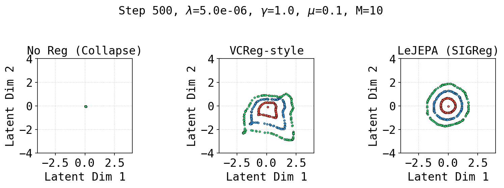

<div align="center">

# Dive into LeJEPA

</div>

<div align="center" style="line-height: 1;">
  <a href="https://github.com/kenanmajewski/marimo-project" target="_blank" style="margin: 2px;"></a>
  <a href="https://arxiv.org/abs/2511.08544" target="_blank" style="margin: 2px;"></a>
  <a href="https://molab.marimo.io/notebooks/nb_vtFTb7WfRDZYZtPuurrYY1/app" target="_blank" style="margin: 2px;">
    
  </a>
</div>

<br>

Interactive from-scratch implementation of the **LeJEPA** framework (Balestriero & LeCun, 2025) in JAX and Equinox. This project provides a hands-on exploration of **SIGReg** (Sketched Isotropic Gaussian Regularization), the principled regularizer that replaces the heuristics used by current JEPA methods, with side-by-side comparisons against prediction-only and VCReg-style baselines.

> **Note**: This is an independent implementation of the ideas from the LeJEPA paper, written from scratch in JAX/Equinox. The authors of the paper are Randall Balestriero and Yann LeCun. The official implementation is at [github.com/rbalestr-lab/lejepa](https://github.com/rbalestr-lab/lejepa).

<div align="center">
<a href="#tldr"><b>TL;DR</b></a> |
<a href="#comparison"><b>Comparison</b></a> |
<a href="#installation"><b>Installation</b></a> |
<a href="#usage"><b>Usage</b></a> |
<a href="#citation"><b>Citation</b></a>
</div>

## TL;DR

The standard prediction objective in JEPAs (minimizing the distance between embeddings of two views of the same input) has a trivial solution: **collapse** to a single point. Existing methods prevent this with stop-gradients, teacher-student networks, and EMA schedules. LeJEPA replaces all of these heuristics with **SIGReg**, a single regularizer that enforces embeddings to follow an isotropic Gaussian distribution via random projections and characteristic function matching.

This implementation lets you:
- **See collapse happen:** train a prediction-only encoder and watch it collapse.
- **Understand SIGReg:** explore the Cramér-Wold principle, characteristic function matching, and why isotropic Gaussian is optimal.
- **Compare methods:** evaluate side-by-side No Reg vs VCReg vs LeJEPA (SIGReg).

<a id="comparison"></a>

## Comparison



*2D embeddings after training three encoders (500 steps, λ=5e-6, γ=1.0, μ=0.1, M=10 projections). Left: prediction-only collapses to a point. Center: VCReg prevents collapse but doesn't enforce isotropy. Right: LeJEPA produces well-structured, isotropic embeddings.*

## Installation

We use [uv](https://docs.astral.sh/uv/) for fast Python package management.

```bash
# Clone the repository
git clone https://github.com/kenanmajewski/dive-into-lejepa
cd dive-into-lejepa 

# Install dependencies
uv sync

# Activate virtual environment
source .venv/bin/activate
```

## Usage

### Interactive Notebook

Explore every concept interactively: collapse, SIGReg mechanics, anisotropy, and method comparisons.

```bash
uv run marimo edit project.py
```

### Standalone Comparison Script

Train and compare No Reg, VCReg, and LeJEPA (SIGReg) encoders, then save the result as `comparison.png`:

```bash
uv run python lejepa.py
```

### Configuration

All hyperparameters can be modified directly in the `Config` class at the top of each file. Key parameters:

| Parameter | Default | Description |
|-----------|---------|-------------|
| `n_samples` | 500 | Number of data points |
| `lr` | 5e-4 | Learning rate |
| `aug_noise` | 0.1 | Noise std for view augmentation |
| `lambda` | 5e-6 | SIGReg weight (LeJEPA) |
| `gamma` | 1.0 | Variance weight (VCReg) |
| `mu` | 0.1 | Covariance weight (VCReg) |
| `num_slices` | 10 | Number of random projections (M) |

## Project Structure

```
marimo-project/
├── project.py          # Marimo notebook: interactive LeJEPA demo
├── lejepa.py           # Standalone script: No Reg vs VCReg vs SIGReg comparison
├── pyproject.toml      # Project config (uv, dependencies)
├── .python-version     # Python version (3.12+)
└── uv.lock             # Lockfile (auto-generated, do not edit)
```

## Citation

If you use this implementation in your research, please cite both the original paper and this implementation:

**Original paper** (by Randall Balestriero and Yann LeCun):

```bibtex
@misc{balestriero2025lejepaprovablescalableselfsupervised,
      title={LeJEPA: Provable and Scalable Self-Supervised Learning Without the Heuristics}, 
      author={Randall Balestriero and Yann LeCun},
      year={2025},
      eprint={2511.08544},
      archivePrefix={arXiv},
      primaryClass={cs.LG},
      url={https://arxiv.org/abs/2511.08544}, 
}
```

**This implementation** (by Kenan Majewski):

```bibtex
@software{majewski2025lejepa_impl,
  author = {Kenan Majewski},
  title = {Dive into LeJEPA: Interactive Implementation in JAX/Equinox},
  url = {https://github.com/kenanmajewski/dive-into-lejepa},
  year = {2025},
}
```

## License

This project is licensed under the MIT License - see the [LICENSE](LICENSE) file for details.
